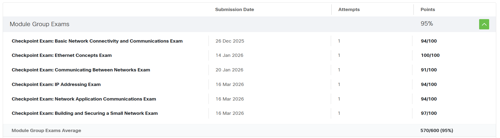

# Portfolio Website

This is my personal portfolio website built to showcase my projects, skills, and experience.

---

## About Me

* **Name:** นางสาวหทัยพัทธ วิสุทธิธรรม
* **Student ID:** 673380297-5
* **Section:** 1

---

## Cisco

| Cisco   | File                     |
| ----- | ------------------------ |
| Pre1 Computer Networks | [Certificate 1](./Cisco/Certificate-1.pdf) |
| CCNA1: Introduction to Networks | [Certificate 2](./Cisco/Certificate-2.pdf) |

---

## Assignments

| Assignment | File                                        |
| ---------- | ------------------------------------------- |
| Essay      | [Essay](./Assignment/personal-essay.pdf)    |
| Topology   | [Topology](./Assignment/assignment-2.pdf)   |
| Not Simple | [Not Simple](./Assignment/assignment-3.pdf) |
| TCP-UDP    | [TCP-UDP](./Assignment/assignment-4.pdf)    |

---

## Laboratory Works

| LAB   | File                     |
| ----- | ------------------------ |
| LAB 1 | [LAB 1](./LAB/LAB-1.pdf) |
| LAB 2 | [LAB 2](./LAB/LAB-2.pdf) |
| LAB 3 | [LAB 3](./LAB/LAB-3.pdf) |
| LAB 4 | [LAB 4](./LAB/LAB-4.pdf) |

---

## Checkpoint exam score

---

## Final Project

* [View Project Files](https://drive.google.com/drive/folders/1x1ucmDRs2I9mPIob3yY6IkaQgVptOJSd)

---

## Notes

This repository contains coursework and projects related to networking and computer science.

---

## Contact

* Email: [hathaipat.wi@kkumail.com](mailto:hathaipat.wi@kkumail.com)
